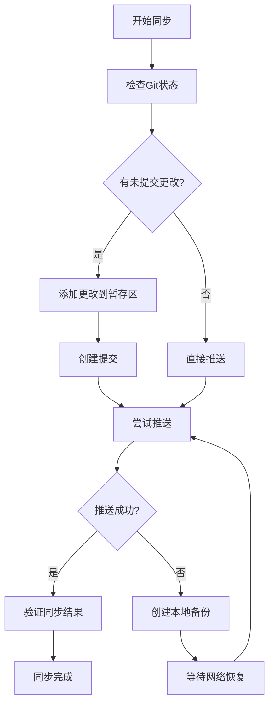

# UniAdapter 项目同步计划

## 项目状态分析
- **项目版本**: v1.2.0
- **Git状态**: 4个提交未推送，18个文件更改
- **网络状态**: 不稳定（project-status.json中标记为"unstable"）
- **备份状态**: 已创建备份（backup_created: true）

## 同步目标
将本地更改（D:\阿里）推送到远程GitHub仓库：
- 仓库地址: https://github.com/liangfuliang541-pixel/uniadapter.git
- 分支: main

## 执行步骤

### 1. 检查当前Git状态
```bash
git status
git log --oneline -10
git remote -v
```

### 2. 查看未提交的更改
```bash
git diff --stat
git diff --name-only
```

### 3. 添加所有更改到暂存区
```bash
git add .
# 或者选择性添加
# git add src/ docs/ package.json project-status.json
```

### 4. 创建提交信息
```bash
git commit -m "同步本地更改 - $(date +'%Y-%m-%d %H:%M:%S')

- 更新项目状态文件
- 完善文档
- 修复测试问题
- 添加新功能适配"
```

### 5. 推送到远程仓库
```bash
# 尝试推送
git push origin main

# 如果推送失败，检查网络并重试
git push --force-with-lease origin main
```

### 6. 处理网络不稳定情况
如果推送失败，执行以下备份策略：
1. 运行 `sync-project.bat` 脚本（自动创建备份）
2. 或手动创建备份：
   ```bash
   backup_dir="backup_$(date +%Y%m%d_%H%M%S)"
   mkdir "%backup_dir%"
   xcopy /E /I /H /Y . "%backup_dir%"
   ```
3. 等待网络恢复后重试推送

### 7. 验证同步结果
```bash
git status
git log --oneline -5
git fetch origin
git diff origin/main..main
```

## 风险与应对措施

### 风险1：网络连接失败
- **应对**: 使用脚本中的备份机制，稍后重试
- **备选**: 使用SSH密钥替代HTTPS（如果配置了SSH）

### 风险2：冲突
- **应对**: 先拉取远程更改解决冲突
  ```bash
  git fetch origin
  git rebase origin/main
  # 解决冲突后继续推送
  ```

### 风险3：权限问题
- **应对**: 检查GitHub令牌或SSH密钥配置
- **验证**: `ssh -T git@github.com`

## 备用方案
如果自动同步失败，手动执行：
1. 压缩项目文件夹为ZIP备份
2. 通过GitHub网页端创建临时仓库上传
3. 或使用GitHub Desktop客户端同步

## 验证指标
- [ ] Git状态显示"Your branch is up to date with 'origin/main'"
- [ ] GitHub仓库显示最新提交时间与本地一致
- [ ] 所有文件更改已推送（通过git diff验证）
- [ ] 项目状态文件更新同步

## 流程图


## 注意事项
1. 确保所有测试通过后再推送（可运行 `npm test`）
2. 更新CHANGELOG.md记录本次同步
3. 检查.gitignore文件，避免推送敏感信息
4. 考虑使用Git标签标记重要版本

## 后续步骤
同步完成后：
1. 更新project-status.json中的网络状态
2. 运行测试验证功能正常
3. 创建同步完成报告
