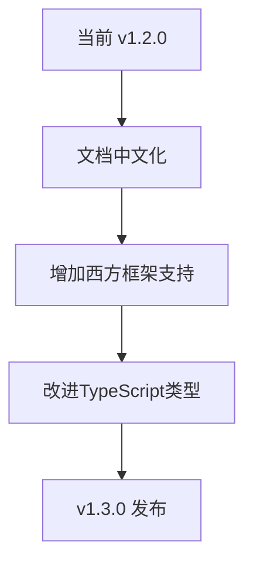
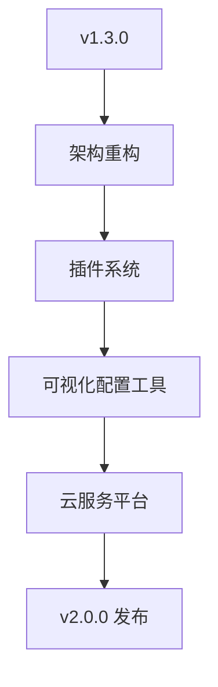

# UniAdapter 项目进化与文档中文化计划

## 1. 项目现状分析

### 1.1 当前国际化状态
- **文档语言**: 95% 英文，5% 中文混合
- **代码注释**: 核心代码有中文注释，但API文档为英文
- **目标受众**: 主要为中文开发者，但项目有全球潜力
- **平台支持**: 8个平台，其中5个是中国特有平台

### 1.2 对全球开发者的价值缺口
1. **语言障碍**: 非中文开发者难以理解中国特有平台的文档
2. **文化差异**: 西方开发者不熟悉微信、抖音等生态
3. **技术栈差异**: 缺少对西方主流框架(Next.js, Nuxt.js)的适配
4. **文档质量**: 缺少分步教程和视频内容

## 2. 文档中文化战略

### 2.1 双语文档架构
```
docs/
├── zh-CN/                    # 中文文档目录
│   ├── getting-started.md    # 快速开始
│   ├── api-reference.md      # API参考
│   ├── platform-guides/      # 平台指南
│   └── examples/             # 中文示例
└── en/                       # 英文文档目录
    └── ...                   # 相同结构
```

### 2.2 文档优先级排序
1. **高优先级** (第1周):
   - README.md 中英双语版
   - 快速开始指南 (中英双语)
   - API基础使用文档

2. **中优先级** (第2-3周):
   - 平台特定指南 (微信、抖音、小红书)
   - 进阶使用文档
   - 故障排除指南

3. **低优先级** (第4周):
   - 贡献者指南
   - API完整参考
   - 架构设计文档

### 2.3 代码注释标准化
```typescript
/**
 * 平台检测适配器
 * Platform detection adapter
 * 
 * 检测当前运行环境并返回对应的平台类型
 * Detects the current runtime environment and returns the corresponding platform type
 * 
 * @param {Object} options 配置选项 Configuration options
 * @returns {PlatformDetection} 平台检测结果 Platform detection result
 * @example
 * // 中文示例 Chinese example
 * const platform = detectPlatform()
 * 
 * // English example
 * const platform = detectPlatform()
 */
export function detectPlatform(options?: DetectionOptions): PlatformDetection {
  // 实现代码 Implementation code
}
```

## 3. 项目进化路线图

### 3.1 短期目标 (v1.3.0 - 1个月内)


**具体功能**:
1. 文档双语化
2. 增加Next.js适配器
3. 增加Vue 3/Nuxt.js适配器
4. 改进国际化类型定义

### 3.2 中期目标 (v2.0.0 - 3个月内)


**具体功能**:
1. 模块化架构重构
2. 插件系统 (支持自定义适配器)
3. 可视化配置工具 (CLI/GUI)
4. 云服务平台 (适配器市场)

### 3.3 长期愿景 (v3.0.0 - 6-12个月)
**"全球开发者的一站式跨平台解决方案"**
1. **AI辅助适配**: 基于AI自动生成平台适配代码
2. **实时预览**: 多平台实时同步预览
3. **性能分析**: 跨平台性能对比和优化建议
4. **生态整合**: 与主流云服务、低代码平台集成

## 4. 具体实施步骤

### 4.1 第一阶段: 文档中文化 (1-2周)
#### 任务清单:
- [ ] 创建双语文档目录结构
- [ ] 翻译核心文档 (README, 快速开始)
- [ ] 添加代码中英双语注释
- [ ] 创建中文示例项目
- [ ] 更新项目状态文件

#### 技术实施:
```bash
# 1. 创建文档结构
mkdir -p docs/zh-CN docs/en
cp docs/*.md docs/en/
# 2. 翻译工具集成
npm install -D i18next react-i18next
# 3. 文档构建流程
npm run docs:build # 构建双语文档
```

### 4.2 第二阶段: 增加西方框架支持 (2-3周)
#### 任务清单:
- [ ] Next.js适配器开发
- [ ] Nuxt.js/Vue 3适配器开发  
- [ ] 西方开发者友好的示例项目
- [ ] 国际社区建设 (Discord, Twitter)

#### 技术实施:
```typescript
// Next.js适配器示例
import { NextRequest, NextResponse } from 'next/server'
import { createUniAdapter } from 'uniadapter/next'

export const uniAdapter = createUniAdapter({
  platforms: ['web', 'mobile', 'pwa'],
  ssr: true
})
```

### 4.3 第三阶段: 架构进化 (4-8周)
#### 任务清单:
- [ ] 插件系统设计与实现
- [ ] 可视化配置工具开发
- [ ] 性能监控系统
- [ ] 开发者体验优化

## 5. 对中国开发者的特别优化

### 5.1 中国特色平台深度支持
1. **微信生态**: 小程序、小游戏、公众号一体化适配
2. **抖音生态**: 短视频、直播、电商API集成
3. **支付宝生态**: 生活号、小程序、芝麻信用
4. **国内云服务**: 阿里云、腾讯云、华为云集成

### 5.2 本土化开发体验
1. **中文错误信息**: 友好的中文错误提示
2. **国内镜像**: npm包国内镜像加速
3. **中文社区**: 中文技术社区和问答平台
4. **本土示例**: 符合中国开发习惯的示例代码

## 6. 对全球开发者的价值主张

### 6.1 核心价值
1. **降低跨平台开发门槛**: 从8个平台到1套代码
2. **保护现有投资**: 无需重写现有项目
3. **未来兼容性**: 新平台自动适配
4. **性能保证**: 零运行时开销

### 6.2 差异化优势
| 特性 | UniAdapter | 竞品1 | 竞品2 |
|------|------------|-------|-------|
| 学习成本 | 低(仅适配层) | 高(完整框架) | 中(部分重写) |
| 迁移成本 | 几乎为零 | 完全重写 | 部分重写 |
| 平台数量 | 8+ (持续增加) | 3-5 | 2-3 |
| 性能开销 | 2KB gzipped | 50KB+ | 20KB+ |

## 7. 成功指标

### 7.1 量化指标
1. **文档访问**: 中文文档访问量增长50%
2. **社区增长**: GitHub star增长100%，国际贡献者增长30%
3. **采用率**: npm下载量月增长20%
4. **用户满意度**: 开发者调查满意度 > 4.5/5

### 7.2 质化指标
1. **品牌认知**: "全球跨平台解决方案"品牌定位确立
2. **生态建设**: 插件市场活跃，第三方适配器 > 10个
3. **行业影响**: 被知名项目采用，技术会议分享

## 8. 风险与应对

### 8.1 技术风险
- **风险**: 多框架适配复杂度高
- **应对**: 采用抽象工厂模式，核心逻辑复用

### 8.2 市场风险  
- **风险**: 国际开发者接受度低
- **应对**: 与西方框架深度集成，提供渐进式迁移方案

### 8.3 资源风险
- **风险**: 双语文档维护成本高
- **应对**: 建立社区翻译团队，自动化翻译流程

## 9. 下一步行动

### 立即开始 (本周):
1. [ ] 创建双语文档目录结构
2. [ ] 翻译README.md核心内容
3. [ ] 更新项目路线图文档
4. [ ] 提交初步实施计划到GitHub

### 短期跟进 (1个月内):
1. [ ] 完成核心文档翻译
2. [ ] 开发Next.js适配器原型
3. [ ] 建立国际社区频道
4. [ ] 发布v1.3.0-beta版本

## 10. 结语

UniAdapter的进化不仅仅是技术升级，更是从"中国优秀工具"到"全球开发者解决方案"的战略转型。通过文档中文化降低中国开发者的使用门槛，同时通过架构进化吸引全球开发者，最终实现"让每一行代码都能运行在任何平台"的愿景。

**核心原则**: 
- 保持轻量级本质 (适配器而非框架)
- 渐进式改进 (不破坏现有API)
- 社区驱动 (开发者需求优先)
- 全球视野 (服务全世界开发者)